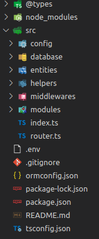

# node-express-cli

`node-express-cli` es un CLI simple y opinado para generar la configuración inicial de un proyecto en express utilizando [Typescript](https://www.typescriptlang.org/), inspirado fuertemente en la arquitectura de [Nest](https://nestjs.com/) pero sin la complejidad que este framework implica y en la cli de Laravel para generar nuevos archivos.

`node-express-cli` no es un framework en sí mismo, sino una herramienta que te ayudará a generar toda la estructura inicial de un proyecto, brindándote una arquitectura sólida y escalable, así como una cli que te ayudará a generar nuevos archivos como migraciones, servicios, entidades, módulos, etc. 

## Uso

Lo primero que debes ejecutar es el comando `npm install -g node-express-cli` para instalarlo como dependencia global. Posteriormente se debe ejecutar el siguiente comando.

```bash
node-express-cli init
```

Este comando te preguntará el nombre de tu proyecto y creará un nuevo directorio con ese nombre, el cuál contendrá todo el código fuente.

Usa `node-express-cli --help` Para ver una lista completa de los comandos disponibles.

El proyecto incluye y debe incluir un archivo llamado cli.config.json con las opciones seleccionadas. 
```Text
{
    "orm": "mongoose", -> opciones disponibles: mongoose | typeorm | sequelize | prisma
    "package_manger": "npm" -> opciones disponibles: npm | yarn | pnpm | bun
    "fileBasedRouting": false, -> opciones disponibles: true | false
}
```

## Estructura de directorios



La estructura generada trata de seguir una arquitectura n-capas pero con una base modular, en donde se tiene un directorio para configuraciones, para base de datos, entidades, utils, middlewares, etc y el más importante: modules, el cual contiene cada módulo del proyecto.

El proyecto generado está configurado para usar alias de módulo o lo que es lo mismo, una abreviación para acceder al directorio src desde cualquier ubicación dentro del mismo; para esto se utiliza el paquete `module-alias`. De esta manera el directorio middlewares es accedido como @/middlewares, services como @/services, modules como @/modules, etc. 
Por ejemplo, una importación se haría de la siguiente manera:

```TS
import { logger } from '@/utils/logger';
```

en lugar de 

```TS
import { logger } from '../../../utils/logger';
```

## Base de datos

En cuanto a bases de datos actualmente el paquete soporta la instalación de 4 ORMs diferentes:

- SQL con [TypeORM](https://typeorm.io/#/), [Sequelize](https://sequelize.org/) o [Prisma](https://www.prisma.io/typescript) 
- MongoDB con [Mongoose](https://mongoosejs.com/)

Para agregar una de las dos opciones utiliza el comando `node-express-cli install:orm`

Una vez creado el proyecto, debes configurar los parámetros de la base de datos dentro del archivo .env
Mismos que serán leídos dentro del archivo src/database/datasources.ts para crear la conexión. Este último debes personalizarlo también, dependiendo el SGDB que deseas utilizar.
Cuando los parámetros sean correctos debes llamar la conexión en el archivo principal del servidor index.ts  

```TS
AppDataSource.initialize()
      .then(() => {
        logger.info('🚀 Database conection is online...')
      })
      .catch(console.log)
```
Si usas mongoose basta con importar el módulo de conexión al inicio del index.ts

```TS
import './database/datasources';
```

Para el caso de Typeorm las nuevas entidades deben ser agregadas como parte del array de entidades en el archivo src/database/datasources.ts, pero para mayor información visita la [documentación oficial](https://typeorm.io/)

Nota: TypeORM, Sequelize o Prisma son solo ORM's, no incluyen la librería específica de postgres, mysql o cualquier otro manejador de base de datos. Para esto debes ejecutar el comando específico de la librería, como `npm i pg` o `npm i mysql`.

### Migraciones
Si utilizas [TypeORM](https://typeorm.io/) se agregarán 6 comandos nuevos al package.json, cuya función es correr, revertir y generar migraciones, respectivamente. Si desea saber más acerca de las migraciones, visite la [documentación oficial](https://typeorm.io/migrations) de TypeORM
- m:run
- m:revert
- m:generate  
- m:create  
- m:drop  
- m:run:fresh 

Para el caso de [Sequelize](https://sequelize.org) también se incluyen una lista de comandos en el package.json

- db:migrate
- db:migrate:undo
- db:migrate:fresh
- db:make:migration

[Prisma](https://www.prisma.io/typescript) por su parte no ocupa crear migraciones manualmente, ya que estas deberán ser creadas a partir de su schema. La lista de comandos para prisma es la siguiente:

- m:run
- m:run:deploy
- m:reset
- m:generate

## Creación de módulos
Un módulo comprende un controlador, un archivo de rutas, uno o más servicios y un archivo de validaciones, todos dentro de un mismo directorio dentro de modules. Esto permite que la aplicación se divida en piezas que son fácilmente conectables. 
El archivo de rutas será creado en el diretorio routes dentro de src, es el único archivo que vive fuera del módulo. Los archivos dentro del direcotio `routes` son importados dinámicamente dentro del punto de entrada de la aplicación, `index.ts`, por lo que lo único que se necesita hacer dentro de un archivo de rutas es exportar por defecto un router de express. E.g

```TS
import { Router } from 'express';

const router = Router();

router.get('/api/products', (req, res) => {
  res.send('Hello World');
});

export default router;
```

Con esto y sin mayor configuración adicional, las rutas del módulo ya estarán disponibles.

Para crear un módulo se utiliza el comando:
```bash
node-express-cli make:module
```
Cada que se crea un módulo debes asignarle un nombre.

## Validación de Request
El body de un request puede ser validado utilizando la librería [express-validator](https://www.npmjs.com/package/express-validator). 
Para esto un módulo incluye un archivo de validación en donde se colocan cada conjunto de validaciones dentro de un array y en la última posición se coloca el middleware requestValidator, el cual se encarga de obtener los mensajes de error generados por express-validator y devolverlos como una respuesta estándar al cliente.

```TS
import { check } from 'express-validator';
import { requestValidator } from '@/middlewares/validator';

export const storeValidators = [
  check('name').isString().isLength({ min: 3, max: 255 }),
  check('email').isEmail(),
  check('password').isString().isLength({ min: 6, max: 255 }),
  requestValidator,
];

export const updateValidators = [
  check('name').isString().isLength({ min: 3, max: 255 }),
  check('email').isEmail(),
  check('password').isString().isLength({ min: 6, max: 255 }),
  requestValidator,
];
```

Y para utilizarlos se pasan como middleware, ya que express permite pasar un array de middlewares a una ruta.
Para más información acerca del uso de express validator visita la [documentación oficial](https://express-validator.github.io/docs/)

```TS
import { storeValidators } from './user.validators';
router.post('/', storeValidators, userController.store);
```

## Logger

Un proyecto REST incluye un Logguer utilizando la librería [winston](https://www.npmjs.com/package/winston). Este logger puede ser utilizado de la siguiente manera: 

```TS
import { logger } from '@/utils/logger';

logger.log('Some Log');
logger.info('Información');
logger.error('Error');
logger.warn('Advertencia');
logger.error('Error', error);
```

Por defecto el logger escribe en la consola y en un archivo llamado `app.log` dentro del directorio logs. Puedes personalizar el logger en el archivo `src/utils/logger.ts` para que escriba en otros destinos o con otros formatos.

## Manejo de errores 
El proyecto incluye un middleware manejador de errores llamado handleErrorMiddleware dentro de /src/middlewares/error_handler.ts, con el propósito de generar respuestas de error estándar al cliente. Este middleware ya está configurado y será ejecutado si una función controladora llama a next(error). 

`error` debe contener una instancia de la clase `HTTPError`. Se incluyen tambien una serie de métodos de utilidad dentro del `error_handler` que nos ayudarán a generar estas instancias. 

El patrón propuesto es que el servicio sea el que lance los errores y el controlador solo los controle para pasarlos a la siguiente capa, de esta manera evitamos que el controlador tenga lógica de negocio y mantenemos la separación de responsabilidades. 

### Servicio
```TS	
import { Forbidden, InternalServerError, NotFound } from '@/middlewares/error_handler';

export async function someService() {
  if (someCondition){
    throw NotFound('Some message');
  }
}
```

### Controlador
```TS
export async function destroy (req: Request, res: Response, next: NextFunction): Promise<void> {
  import { someService } from '@/services/someService';

  try {
    const response = await someService();
    res.json(response)
  } catch (error: any) {
    next(error)
  }
}
```

## Instalación de Socket
Adicionalmente después de crear el servidor es posible instalar el uso de sockets mediante la librería [https://socket.io/](socket.io). 
Para ello utilizar el comando 
```bash
node-express-cli install:socket
```

Es importante que esta acción se realice antes de personalizar el archivo principal del servidor index.ts, pues reemplazará todo su contenido con la nueva configuración para soportar el socket.
Se agregarán además dos archivos: socket.ts y socket.controller.ts, los cuales contienen la configuración y la lógica para el manejo de los sockets.

## Instalación de Prettier y ESlint
La instalación de [Prettier](https://prettier.io/) y [ESlint](https://eslint.org/) se incluyen como opciones separadas para ofrecer una configuración más granular. 
Para instalar prettier: 
```bash
node-express-cli install:prettier
```
Para instalar ESlint
```bash
node-express-cli install:eslint
```
Es necesario instalar prettier para poder instalar eslint. 

## Scaffolding de autenticación
Es posible instalar un módulo de autenticación con lo básico necesario para autenticar un usuario con JWT, haciendo uso de la conocida librería [Passport](https://www.npmjs.com/package/passport).  
Para instalarlo utiliza el comando `node-express-cli install:auth`.
Esta acción creará un modelo básico de usuario, una estrategia de passport y un módulo de autenticación. 
Solamente deberás agregar las rutas del módulo auth al router principal de la aplicación y crear/ejecutar las migraciones para la base de datos, de ser necesario. 

## Envío de Emails
Es posible agregar soporte para envío de emails vía nodemailer, utilizando el comando `node-express-cli install:mailer`.  
Esta acción instalará una clase Mailer, dentro del directorio utils, la cual tiene la lógina necesaria para envío de emails y notificaciones.  
Se instala además un template básico html para las notificaciones, el cuál es compilado mediante handlebars. Un ejemplo de envío de una notificación es: 

```TS
Mailer.sendNotification({
    to: 'joe@gmail.com',
    subject: 'Asunto del mensaje',
    atte: 'Foo Bar',
    content: 'Contenido de la notificación',
    greeting: 'Hola!',
    action: {
      title: 'Visita nuestro sitio',
      url: 'http://www.my-site.com',
    },
})
```

## Ruteo basado en archivos
Al crear un proyecto puedes elegir si deseas que las rutas sean manejadas con base en tu sistema de archivos (similar a lo que hace Next.js) o si prefieres manejarlas de manera manual, eportando un router de express en cada archivo de rutas (como se mencionó en la sección de módulos).
El ruteo basado en archivos es una opción que permite que las rutas sean manejadas de manera automática, sin necesidad de importarlas manualmente en el archivo principal del servidor. Las rutas serán creadas basandose en los nombres de los archivos y directorios dentro de la carpeta routes. Ejemplo: 

La siguiente estructura de archivos:

```
routes
│   index.ts
│
└───api
│   │
│   └───users
│   |    │   index.ts
│   |    │----[id]
|   |          │   index.ts
|   |---products
|        |   index.ts
|        |   [id].ts
│
└───auth
    │   login.ts
    │   register.ts
```

Generará las siguientes rutas:

```
GET /
POST /

GET /api/users
POST /api/users
GET /api/users/:id
PUT /api/users/:id
DELETE /api/users/:id

POST /auth/login
POST /auth/register

GET /api/products
POST /api/products
GET /api/products/:id
PUT /api/products/:id
DELETE /api/products/:id
``` 

La ruta final será la concatenación de los nombres de los directorios y archivos, separados por un slash, partiendo desde el directorio raíz de las rutas (/) hasta un archivo index.ts o un archivo con cualquier otro nombre.
Si un archivo es llamado `index.ts` se el final de la ruta será el nombre del directorio padre, mientras que si un archivo tiene cualquier otro nombre, este será el final de la ruta.
Para utilizar segmentos dinámicos (parámetros de ruta) se debe crear un directorio con el nombre del parámetro entre corchetes.

Los archivos de rutas deben exportar por defecto un objeto que contenga los handlers que serán ehecutados para cada método HTTP. E.g

```TS
import { Request, Response } from 'express'

function GET(req: Request, res: Response) {
  res.json({ status: 'ok' })
}

export default {
  GET
} satisfies RestController
```

Cada handler puede ser una función o un array de funciones, en cuyo caso se ejecutarán en orden. E.g

```TS
import { Request, Response } from 'express'

function middleware(req: Request, res: Response, next: NextFunction) {
  console.log('Middleware')
  next()
}
function GET(req: Request, res: Response) {
  res.json({ status: 'ok' })
}
export default {
  GET: [middleware, GET]
} satisfies RestController

```

## Levantar el servidor 

### Desarrollo
Para levantar el servidor en desarrollo usar el script "dev"

```bash
npm run dev
```
Si no existe el directorio build antes de ejecutar este comando, es posible que sea necesario parar y ejecutar el comando nuevamente.

### Producción

Para compilar el proyecto utilizar el comando: 
```bash
npm run build
```

Para iniciar el servidor compilado utilizar el comando:

```bash
npm start
```

## Variables de entorno

Las variables de entorno son manejadas usando el paquete [dotenv](https://www.npmjs.com/package/dotenv). Para esto debe agregarse un archivo .env en la raíz del proyecto con las variables de entorno necesarias.
El proyecto incluye un archivo .env.example que contiene las variables de entorno necesarias para el correcto funcionamiento del servidor. Estas variables son después concentradas (y te sugerimos que así lo hagas) en un objeto global dentro de `src/config/config.ts` para ser utilizadas en cualquier parte del proyecto y disfrutar del auto completado de typescript.
