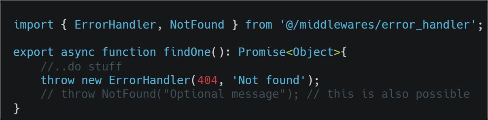

# node-express-cli

node-express-cli es un CLI simple y opinado para generar la configuración inicial de un proyecto en express utilizando [Typescript](https://www.typescriptlang.org/). Es util para generar proyectos API REST y API's GraphQL.
node-express-cli actualmente ofrece las siguientes caracteristicas

- Creación de la configuración inicial del proyecto (estructura de directorios, scripts, dependencias de desarrollo, etc.)
- Instalación de Prettier
- Instalación de Eslint
- Creación de módulos
- Instalación de Socket con socket.io

## Uso

Lo primero que debes ejecutar es el comando `npm install -g node-express-cli` para instalarlo como dependencia global. Posteriormente se debe ejecutar el siguiente comando dentro de un directorio vacío que será la raíz del proyecto.

```
node-express-cli init
```

Existen 3 opciones para generar el proyecto:

- API Rest
- GraphQL

Cada una generará una configuración diferente en cuanto a middlewares y dependencias de desarrollo. Además la manera en que se configura el archivo index.ts del servidor es diferente para cada una.

Usa `node-express-cli --help` Para ver una lista completa de los comandos disponibles.

Nota: Para la plataforma Windows existe un pequeño bug al crear el proyecto: No se crea un script "dev". Se está trabajando en ello, pero si notas que no existe dicho script dentro del package.json puedes agregarlo manualmente copiando y pegando la siguiente línea.

```
"dev": "tsc-watch --onSuccess \"node build/index\""
```

Notarás además que el package.json está de manera minificada, en una sola línea, ocurre lo mismo con el archivo tsconfig.json. Ambos pueden ser formateados correctamente utilizado algun formateador de código como prettier.

## Estructura de directorios


La estructura generada trata de seguir una arquitectura modular, en donde se tiene un directorio para configuraciones, para base de datos, entidades, helpers, middlewares y el más importante modules.
En este último se contiene cada módulo del proyecto.

Para proyectos API REST se incluyen alias de módulo o lo que es lo mismo, abreviaciones para acceder a cada directorio. De esta manera el directorio middlewares es accedido como @middlewares, services como @services, modules como @modules, etc. (Actualmente esta característica no es soportada para proyectos Web o GraphQL)
Por ejemplo, una importación se haría de la siguiente manera:


## Base de datos

En cuanto a bases de datos actualmente el paquete soporta 2 opciones

- SQL con [TypeORM](https://typeorm.io/#/)
- MongoDB con [Mongoose](https://mongoosejs.com/)

Una vez creado el proyecto, debes configurar los parámetros de la base de datos dentro del archivo .env
Mismos que serán leídos dentro del archivo src/database/database.ts para crear la conexión. Este último debes personalizarlo también, dependiendo el SGDB que deseas utilizar.
Cuando los parámetros sean correctos debes llamar la conexión en el archivo principal del servidor index.ts

```
//importing database
import './database/database';
```
Es muy importante que las entidades de base de datos dentro del directorio src/entities/ terminen con extensión .entity.ts, de lo contrario no podrán ser accedidas por typeorm al realizar el proceso de introspección y se generará un error al arrancar el servidor. 

Nota: TypeORM es solo un ORM, no instala la librería específica de postgres, mysql o cualquier otro manejador de base de datos. Para esto debes ejecutar el comando específico de la librería, como `npm install pg` o `npm install mysql`.

## Creación de módulos
Un módulo comprende un controlador, un archivo de rutas, un servicio y un archivo de validaciones, todos dentro de un mismo directorio dentro de modules. Esto permite que la aplicación se divida en piezas que son fácilmente conectables. 
Para conectar las rutas de un módulo es necesario agregar el router del módulo al router principal del servidor, router.ts.


Con esto y sin mayor configuración adicional, las rutas del módulo ya estarán disponibles. Pues el router principal ya está siendo cargado en el archivo principal del servidor. 

Para crear un módulo se utiliza el comando:
```
node-express-cli make:module
```
Cada que se crea un módulo debes asignarle un nombre y de qué tipo será: Rest, Web o GraphQL. Asegurate de seleccionar la misma opción que utilizaste para crear el proyecto, pues el módulo varia ligeramente entre cada tipo de configuración. 

## Validación de Request
El body de un request puede ser validado utilizando la librería [express-validator](https://www.npmjs.com/package/express-validator). 
Para esto un módulo incluye un archivo de validación en donde se colocan cada conjunto de validaciones dentro de un array.


Y para utilizarlos se pasan como middleware a una ruta, seguidos del middleware validateBody, encargado de obtener todos los mendajes de error y regresarlos como una respuesta estándar al cliente.


## Logger

Un proyecto REST incluye un Logguer utilizando la librería [winston](https://www.npmjs.com/package/winston). Este logger puede ser utilizado de la siguiente manera: 


## Manejo de errores 
El proyecto incluye un middleware manejador de errores llamado handleErrorMiddleware dentro de /src/middlewares/error_handler.ts, con el propósito de generar respuestas de error estándar al cliente. Este middleware ya está configurado y será ejecutado si una función controladora llama a next(error). 

error debe contener una instancia de la clase ErrorHandler.

El patrón propuesto es que el servicio sea el que lance los errores y el controlador solo los controle para pasarlos a la siguiente capa.

### Servicio


### Controlador


## Instalación de Socket
Adicionalmente después de crear el servidor es posible instalar el uso de sockets mediante la librería [https://socket.io/](socket.io). 
Para ello utilizar el comando 
```
node-express-cli install:socket
```

Es importante que esta acción se realice antes de personalizar el archivo principal del servidor index.ts, pues reemplazará todo su contenido con la nueva configuración para soportar el socket. 

## Instalación de Prettier y ESlint
La instalación de [Prettier](https://prettier.io/) y [ESlint](https://eslint.org/) se incluyen como opciones separadas para ofrecer una configuración más granular. 
Para instalar prettier: 
```
node-express-cli install:prettier
```
Para instalar ESlint
```
node-express-cli install:eslint
```
Es necesario instalar prettier para poder instalar eslint. 

## Levantar el servidor 

### Desarrollo
Para levantar el servidor en desarrollo usar el script "dev"

```
npm run dev
```
Si no existe el directorio build antes de ejecutar este comando, es posible que sea necesario parar y ejecutar el comando nuevamente.

### Producción

Para compilar el proyecto utilizar el comando: 
```
npm run build
```

Para iniciar el servidor compilado utilizar el comando:

```
npm start
```

